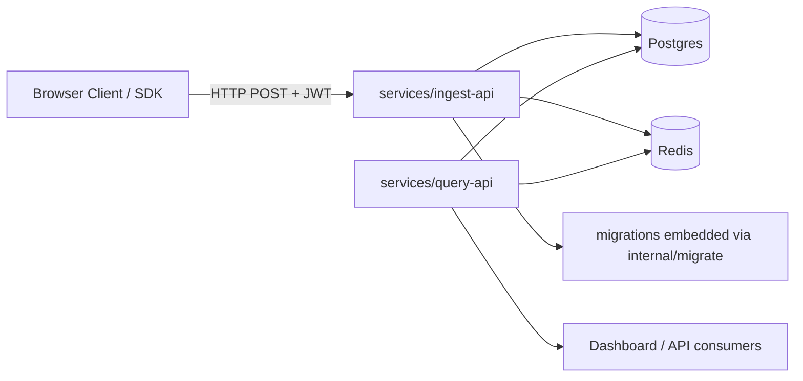

# Project Overview

RTCMon is a Go monorepo for a self-hosted WebRTC monitoring backend. It is
organized around two services: an ingest API for receiving telemetry and a
query API for serving analytics, with shared internal packages for config,
auth, caching, database access, logging, models, and schema migrations.

## Repository Structure

- `.claude/` - Local agent and prompt configuration for this workspace.
- `docs/` - Product, architecture, and reference documents for the platform.
  - `Breakdown_Task.md` - Task breakdown notes.
  - `PRD.md` - Product requirements document.
  - `RFC.md` - Technical architecture RFC for the platform.
  - `vs_ObserveRTC.md` - External reference notes on ObserveRTC.
  - `vs_RTCStats.md` - External reference notes on RTCStats.
- `internal/` - Shared Go packages used by both services.
  - `auth/` - JWT-related auth helpers and tests.
  - `cache/` - Redis cache helpers and tests.
  - `config/` - Config loading from YAML and environment variables.
  - `db/` - PostgreSQL connection pool helpers and tests.
  - `logger/` - Logging setup and tests.
  - `migrate/` - Embedded migration runner and tests.
  - `model/` - Domain models for ingest and query flows.
- `migrations/` - SQL schema migrations embedded into the Go binaries.
- `plans/` - Feature-by-feature implementation plans and walkthroughs.
  - `BE-001/` - Plan and walkthrough for backend task BE-001.
  - `BE-002/` - Plan and walkthrough for backend task BE-002.
  - `BE-003/` - Plan and walkthrough for backend task BE-003.
  - `BE-004/` - Plan and walkthrough for backend task BE-004.
  - `BE-005/` - Plan and walkthrough for backend task BE-005.
- `services/` - Executable entrypoints for deployed APIs.
  - `ingest-api/` - Cobra-based CLI for the ingest service and DB migrations.
  - `query-api/` - Cobra-based CLI for the query service.
- `Makefile` - Canonical developer commands for build, lint, test, and migrations.
- `go.mod` - Module definition and direct dependency manifest.
- `go.sum` - Checksums for Go module resolution.

## Build & Development Commands

Install dependencies and normalize module metadata:

```sh
make tidy
```

Build the full module:

```sh
make build
```

Run the full test suite with the race detector:

```sh
make test
```

Run the shorter test suite for quick feedback:

```sh
make test-short
```

Run linting and format checks:

```sh
make lint
```

Type-check:

> TODO: No dedicated type-check target exists today. Use `make build` as the
> closest compile-time validation until a narrower target is added.

Run the ingest API CLI:

```sh
go run ./services/ingest-api serve
```

Run the query API CLI:

```sh
go run ./services/query-api serve
```

Apply database migrations:

```sh
make migrate-up
```

Roll back database migrations:

```sh
make migrate-down
```

Create a new migration file pair:

```sh
make migrate-create name=add_something
```

Debug:

> TODO: No repo-owned debugger workflow or Delve launch config is checked in.

Deploy:

> TODO: No deployment automation, manifests, or release pipeline is present in
> this repository.

## Code Style & Conventions

- Favor small, package-oriented designs with clear ownership boundaries. Shared
  packages under `internal/` should expose narrow constructor or helper APIs
  such as `config.Load`, `logger.New`, `db.NewPool`, and `cache.NewClient`.
- Prefer composition over inheritance-style abstractions. Keep business logic in
  plain Go functions and structs, and use interfaces only when a real boundary
  or test seam already exists.
- Thread `context.Context` through I/O and network boundaries such as database,
  Redis, migrations, and request-scoped work.
- Return errors instead of panicking, and wrap external-call failures with repo-
  scoped context using `fmt.Errorf("package: action: %w", err)`.
- Keep HTTP and CLI entrypoints thin. Parse config, initialize dependencies, and
  delegate behavior into `internal/` packages rather than growing service mains.
- Follow standard Go formatting with `gofmt` and import normalization with
  `goimports`; both are enabled in `.golangci.yml`.
- Run `make lint` before submitting changes. Enabled linters are `errcheck`,
  `staticcheck`, `govet`, and `unused`.
- Keep package names short, lowercase, and aligned with directory names.
- Use exported `CamelCase` names for public types and functions and unexported
  `camelCase` names for package-local symbols.
- Keep exported APIs documented when the behavior is not obvious; several
  packages already use package comments and doc comments as the expected style.
- Prefer descriptive names over abbreviations unless the term is already common
  in the domain, such as `cfg`, `ctx`, `JWT`, `ICE`, or `TS`.
- Keep zero values useful where practical, and make helper accessors return safe
  defaults instead of forcing nil checks when the package contract can avoid it.
- Match the existing testing style in production code: early returns, explicit
  guard clauses, and minimal nesting.
- Keep tests adjacent to the package under test and use Go's `_test.go`
  convention.
- Prefer configuration via `config.yaml` and environment variables rather than
  hard-coded values.
- Commit message template:
  > TODO: No repository-specific commit convention is documented yet.

## Architecture Notes



The repository implements a split-service backend. `services/ingest-api`
accepts telemetry-oriented traffic and owns schema migration commands, while
`services/query-api` is intended to serve analytics reads. Shared behavior lives
under `internal/`: config loading uses Viper, logging uses Logrus, PostgreSQL
access is isolated in `internal/db`, Redis helpers are isolated in
`internal/cache`, and schema changes are embedded from `migrations/` and applied
through `internal/migrate`. The current service entrypoints are scaffolds: both
`serve` commands load config and initialize logging, but the HTTP server wiring
is still marked as future work.

## Testing Strategy

- Unit tests live alongside each internal package, for example in `internal/auth`
  and `internal/config`.
- Prefer focused unit tests around observable behavior: success paths, invalid
  input, expired credentials, malformed config, and unreachable dependencies.
- Current tests mix pure unit coverage with opt-in integration checks. Redis-
  backed tests use `TEST_REDIS_URL` and skip cleanly when the dependency is not
  available.
- Keep tests deterministic and fast by default. Use timeouts on networked calls
  and avoid depending on shared external state when a package-level unit test is
  sufficient.
- Add or update tests in the same package when changing parsing, validation,
  serialization, middleware behavior, pool setup, or migration logic.
- The canonical local test command is:

```sh
make test
```

- Use the shorter loop for fast local iteration:

```sh
make test-short
```

- Coverage expectations:
  > TODO: No minimum coverage threshold or coverage-report target is defined in
  > this repository today.
- Until a formal threshold exists, new changes should include enough tests to
  exercise the main success case and the most important failure modes for the
  touched package.
- Coverage reporting:
  > TODO: No Make target or CI job currently publishes `go test -cover` output.
- Integration and end-to-end coverage:
  > TODO: No dedicated integration or e2e test harness is checked in yet.
- CI execution:
  > TODO: No CI workflow is present under `.github/`; add one before relying on
  > automated enforcement.

## Security & Compliance

- Treat `DB_URL`, `REDIS_URL`, and `AUTH_JWT_SECRET` as secrets. Do not hard-code
  them in source, tests, or committed config files.
- `internal/config` supports environment-variable overrides, so prefer env-based
  secret injection over checked-in `config.yaml` values.
- Review changes in `internal/auth`, `internal/db`, `internal/cache`, and
  `migrations/` carefully because they affect authentication, persistence, and
  production data handling.
- Dependency scanning:
  > TODO: No dependency scanning or SCA workflow is configured in this repo.
- License notes:
  > TODO: No top-level `LICENSE` file is present; confirm distribution terms
  > before publishing binaries or reusing content externally.

## Agent Guardrails

- Do not edit `.git/` contents or hand-modify `go.sum`; update module metadata
  through Go tooling such as `make tidy`.
- Do not rewrite existing migration files after they have been reviewed or
  applied; add a new migration instead unless a human explicitly asks otherwise.
- Do not change `plans/` or `docs/` content unless the task is explicitly about
  planning or documentation.
- Require human review for changes touching `internal/auth`, `internal/config`,
  `internal/db`, `internal/cache`, `migrations/`, or public CLI behavior under
  `services/`.
- Keep changes scoped to the requested task; avoid opportunistic refactors across
  multiple internal packages.
- Rate limits:
  > TODO: No repository-specific automation rate-limit policy is documented.
  > Avoid repeated external calls or destructive migration loops without review.

## Extensibility Hooks

- Configuration can come from `config.yaml` in the working directory or from
  environment variables using the `SECTION_KEY` pattern.
- Supported environment variables visible in `internal/config` include:
  `SERVER_PORT`, `SERVER_METRICS_PORT`, `DB_URL`, `DB_MAX_CONNS`,
  `DB_MIN_CONNS`, `DB_CONN_LIFETIME`, `REDIS_URL`, `REDIS_POOL_SIZE`,
  `AUTH_JWT_SECRET`, `WORKER_COUNT`, `WORKER_BATCH_SIZE`,
  `WORKER_FLUSH_INTERVAL_MS`, `WORKER_CHANNEL_CAP`, and `LOG_LEVEL`.
- New service commands should be added through the Cobra roots in
  `services/ingest-api` and `services/query-api`.
- New shared functionality should generally live in `internal/` so both services
  can depend on the same implementation.
- Feature flags:
  > TODO: No feature-flag framework or toggle registry is implemented yet.

## Further Reading

- [docs/PRD.md](docs/PRD.md)
- [docs/RFC.md](docs/RFC.md)
- [docs/Breakdown_Task.md](docs/Breakdown_Task.md)
- [plans/BE-001/Plan.md](plans/BE-001/Plan.md)
- [plans/BE-001/Walkthrough.md](plans/BE-001/Walkthrough.md)
- [plans/BE-002/Plan.md](plans/BE-002/Plan.md)
- [plans/BE-002/Walkthrough.md](plans/BE-002/Walkthrough.md)
- [plans/BE-003/Plan.md](plans/BE-003/Plan.md)
- [plans/BE-003/Walkthrough.md](plans/BE-003/Walkthrough.md)
- [plans/BE-004/Plan.md](plans/BE-004/Plan.md)
- [plans/BE-004/Walkthrough.md](plans/BE-004/Walkthrough.md)
- [plans/BE-005/Plan.md](plans/BE-005/Plan.md)
- [plans/BE-005/Walkthrough.md](plans/BE-005/Walkthrough.md)